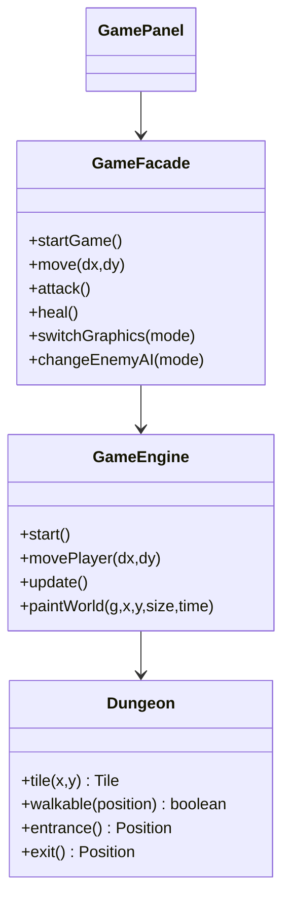
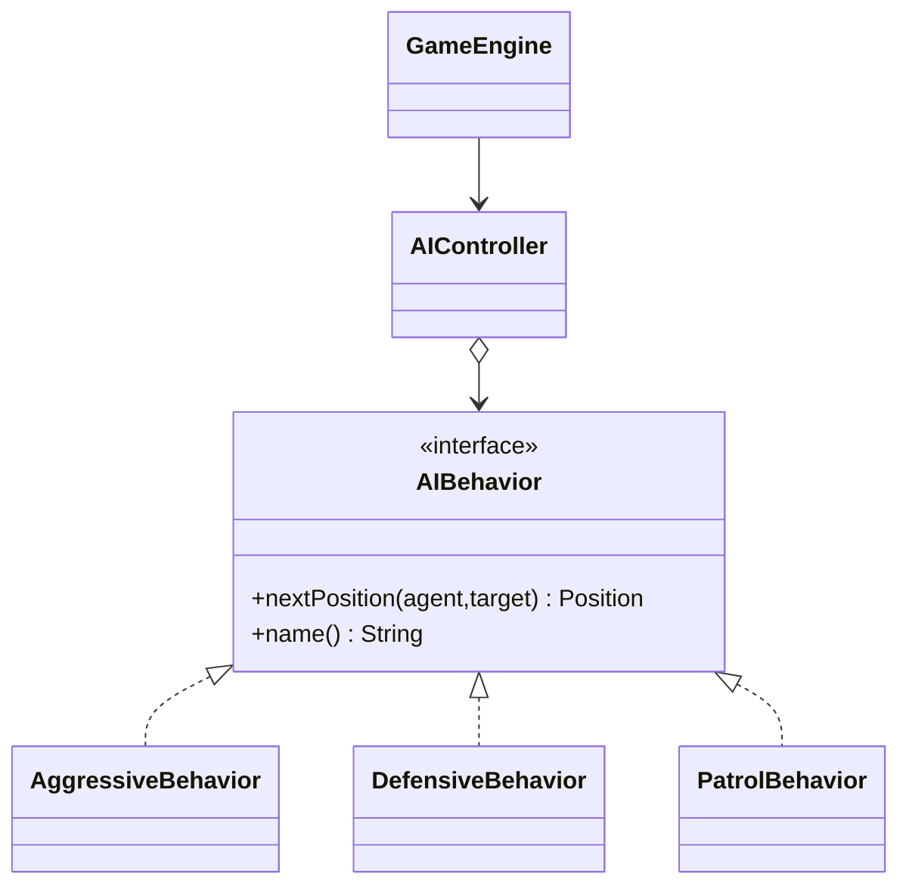
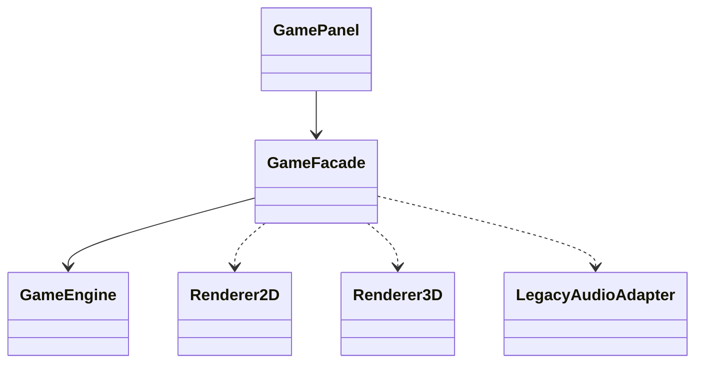
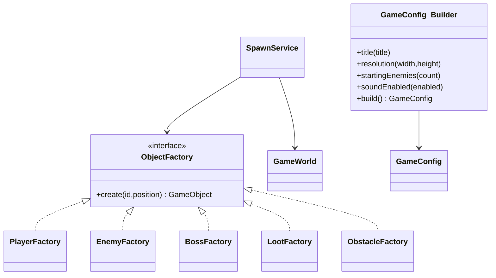
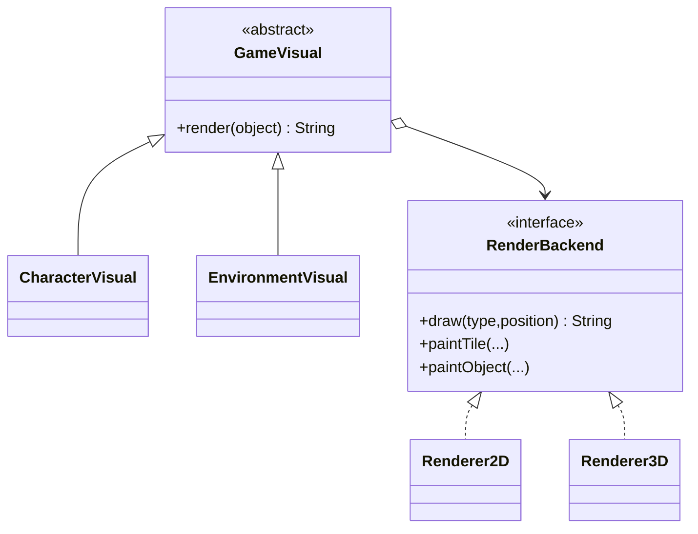
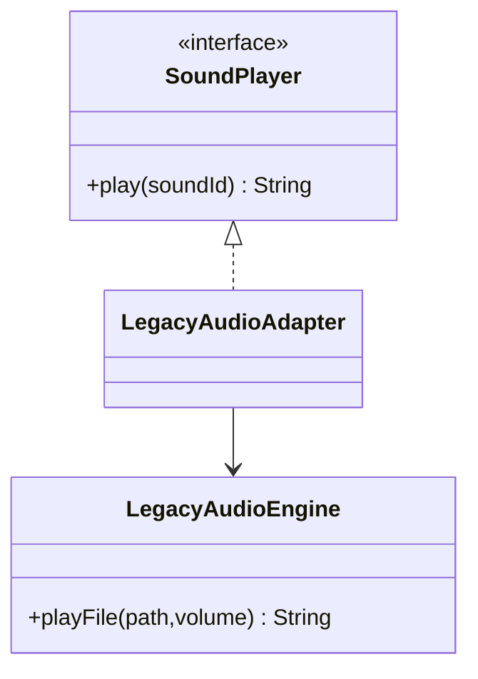

# UML (Mermaid) — Pattern Quest

## Integration

```mermaid
classDiagram
    class GamePanel
    class GameFacade {
       +startGame()
       +move(dx,dy)
       +attack()
       +heal()
       +switchGraphics(mode)
       +changeEnemyAI(mode)
    }
    class GameEngine {
       +start()
       +movePlayer(dx,dy)
       +update()
       +paintWorld(g,x,y,size,time)
    }
    class Dungeon {
       +tile(x,y) Tile
       +walkable(position) boolean
       +entrance() Position
       +exit() Position
    }
    GamePanel --> GameFacade
    GameFacade --> GameEngine
    GameEngine --> Dungeon
```

## Strategy (Moldir)

```mermaid
classDiagram
    class AIBehavior {
       <<interface>>
       +nextPosition(agent,target) Position
       +name() String
    }
    class AggressiveBehavior
    class DefensiveBehavior
    class PatrolBehavior
    AIBehavior <|.. AggressiveBehavior
    AIBehavior <|.. DefensiveBehavior
    AIBehavior <|.. PatrolBehavior
    AIController o--> AIBehavior
    GameEngine --> AIController
```

## Facade (Moldir)

```mermaid
classDiagram
    GamePanel --> GameFacade
    GameFacade --> GameEngine
    GameFacade ..> Renderer2D
    GameFacade ..> Renderer3D
    GameFacade ..> LegacyAudioAdapter
```

## Factory Method + Builder (Askar)

```mermaid
classDiagram
    class ObjectFactory {
       <<interface>>
       +create(id,position) GameObject
    }
    ObjectFactory <|.. PlayerFactory
    ObjectFactory <|.. EnemyFactory
    ObjectFactory <|.. BossFactory
    ObjectFactory <|.. LootFactory
    ObjectFactory <|.. ObstacleFactory
    SpawnService --> ObjectFactory
    SpawnService --> GameWorld
    class GameConfig_Builder {
       +title(title)
       +resolution(width,height)
       +startingEnemies(count)
       +soundEnabled(enabled)
       +build() GameConfig
    }
    GameConfig_Builder --> GameConfig
```

## Bridge (Almanzor)

```mermaid
classDiagram
    class GameVisual {
       <<abstract>>
       +render(object) String
    }
    GameVisual <|-- CharacterVisual
    GameVisual <|-- EnvironmentVisual
    GameVisual o--> RenderBackend
    class RenderBackend {
       <<interface>>
       +draw(type,position) String
       +paintTile(...)
       +paintObject(...)
    }
    RenderBackend <|.. Renderer2D
    RenderBackend <|.. Renderer3D
```

## Adapter (Almanzor)

```mermaid
classDiagram
    class SoundPlayer {
        <<interface>>
        +play(soundId) String
    }
    SoundPlayer <|.. LegacyAudioAdapter
    LegacyAudioAdapter --> LegacyAudioEngine
    class LegacyAudioEngine {
       +playFile(path,volume) String
    }
```
